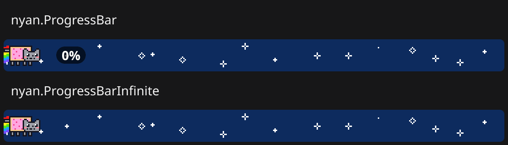
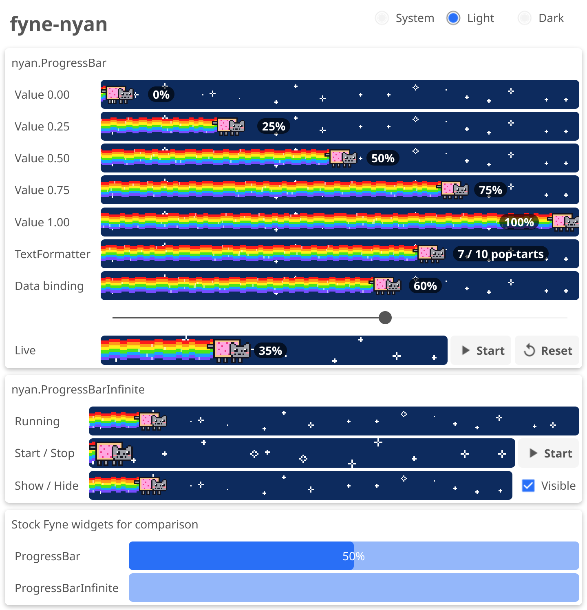
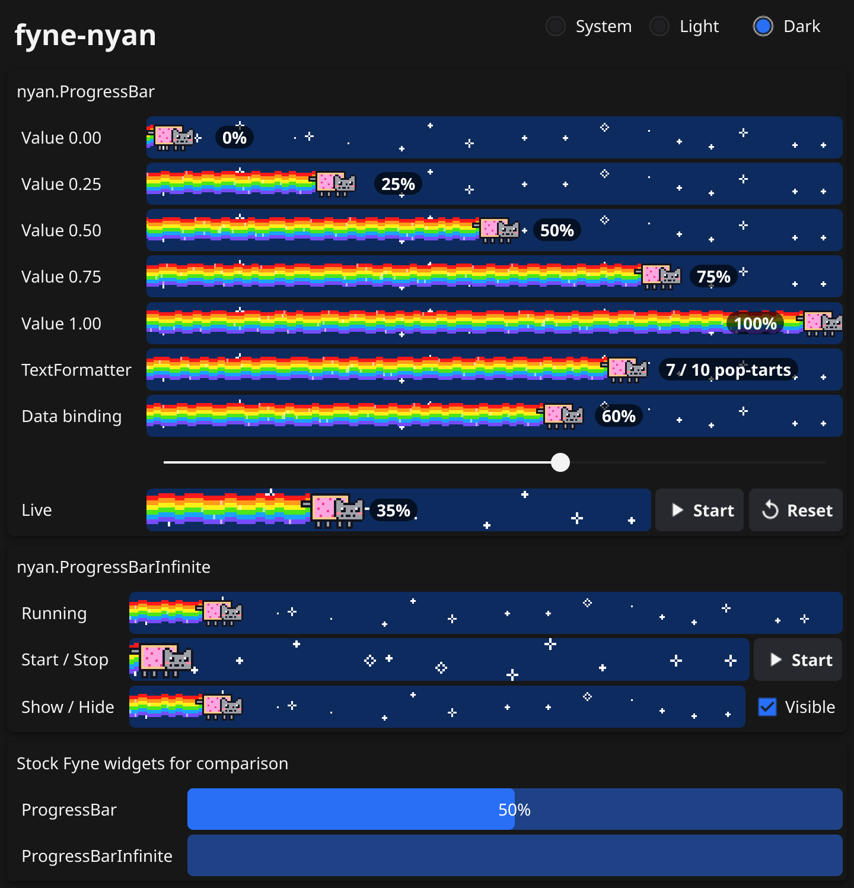

# fyne-nyan

[](https://github.com/timzifer/fyne-nyan/actions/workflows/ci.yml)
[](https://github.com/timzifer/fyne-nyan/actions/workflows/ci.yml)
[](https://pkg.go.dev/github.com/timzifer/fyne-nyan)
[](LICENSE)

Progress bars for [Fyne](https://fyne.io) with a pop-tart cat flying through space, leaving a rainbow behind.

*Somebody had to do it.*



- **Drop-in replacement** for `widget.ProgressBar` and `widget.ProgressBarInfinite`: same fields, same methods, data binding included.
- **Determinate**: the cat flies along with the value, and the readout travels next to it.
- **Indeterminate**: the cat loops endlessly, trailing a rainbow flag that fades out after about a third of the bar.
- **Pixel art that stays crisp** at any size and scale, with twinkling stars and wave segments of varying width.
- Pure Go, no assets: everything is drawn in code.

## Install

```sh
go get github.com/timzifer/fyne-nyan
```

Requires Fyne v2.8 or newer.

## Usage

```go
import nyan "github.com/timzifer/fyne-nyan"

// determinate, Min 0 / Max 1 by default
bar := nyan.NewProgressBar()
bar.SetValue(0.42)

// custom range and text
files := &nyan.ProgressBar{Min: 0, Max: 10}
files.TextFormatter = func() string {
	return fmt.Sprintf("%.0f / %.0f files", files.Value, files.Max)
}
files.ExtendBaseWidget(files)

// data binding
progress := binding.NewFloat()
bound := nyan.NewProgressBarWithData(progress)

// indeterminate
busy := nyan.NewProgressBarInfinite()
busy.Stop()  // may be called before the bar is shown
busy.Start()
```

To swap the stock widgets, change `widget.NewProgressBar()` to `nyan.NewProgressBar()` and `widget.NewProgressBarInfinite()` to `nyan.NewProgressBarInfinite()`.

As with every Fyne widget, call `SetValue`, `Start` and `Stop` from the main goroutine, or wrap them in `fyne.Do` when calling from elsewhere. Data bindings already do that for you.

## Example app

[`example/nyan`](example/nyan) shows every state: fixed values, `TextFormatter`, data binding with a slider, a live bar, running, stopped and hidden indeterminate bars, the stock widgets for comparison, and a light/dark switch.

```sh
go run ./example/nyan
```

| Light | Dark |
|-------|------|
|  |  |

## Development

```sh
go test ./...                    # unit and golden image tests
golangci-lint run ./...          # lint
go test -run Shots -shots .      # re-render the images in docs/
```

All screenshots are rendered headlessly with Fyne's software renderer and a fake clock, so they are reproducible. After a visual change, the golden image tests write the new rendering to `testdata/failed/`. Check it, then move it to `testdata/`.

CI runs lint, then tests on Linux, Windows and macOS with the two latest Go releases, plus a coverage gate. The coverage badge is committed to the `badges` branch by [go-test-coverage](https://github.com/vladopajic/go-test-coverage), so no external service is needed.

## Credits

All glory to **Chris Torres** ("prguitarman"), who created [Nyan Cat](https://en.wikipedia.org/wiki/Nyan_Cat), the pop-tart cat, in 2011, and to **daniwell**, whose song made it unforgettable. See [nyan.cat](https://www.nyan.cat/) for the real thing, in all its looping glory.

Thanks also to the [Nyan Progress Bar](https://plugins.jetbrains.com/plugin/8575-nyan-progress-bar) plugin for JetBrains IDEs, which has made waiting for builds bearable for years and is the reason this project exists.

The cat, rainbow and stars in this repository are original pixel art drawn in code: a homage, not a copy of the original artwork. This project is not affiliated with or endorsed by Chris Torres. Nyan Cat is his creation and trademark.

## License

[MIT](LICENSE)
